# HF_SWITCHED_LPF_BANK

Плата перемикального банку ФНЧ для КХ-підсилювача потужністю до 250 Вт.

## Підтримувані діапазони
- 80 м (3,6 МГц)
- 40 м (7,2 МГц)
- 20 м (14 МГц)
- 15 м (21 МГц)

## Живлення (Роз'єм X4)
- Напруга живлення плати: 12..24В.
- Споживання не більше: 100 мА
## Керування (Роз'єм X3)
| Діапазон | Частота | A | B | C | D | Код ABCD |
|---|---:|:---:|:---:|:---:|:---:|:---:|
| 80 м | 3,5 МГц | 1 | 0 | 0 | 0 | `1000` |
| 40 м | 7 МГц | 0 | 1 | 0 | 0 | `0100` |
| 20 м | 14 МГц | 0 | 0 | 1 | 0 | `0010` |
| 15 м | 21 МГц | 0 | 1 | 1 | 0 | `0110` |

## Розрахунок ФНЧ для КХ-діапазонів

Для розрахунків використано онлайн-калькулятор [LC Filter Design Tool](https://markimicrowave.com/technical-resources/tools/lc-filter-design-tool/) від Marki Microwave.

### Результати розрахунків

| Діапазон | Частота розрахунку | Результат |
|:---:|:---:|:---:|
| **80 м** | 3,6 МГц | 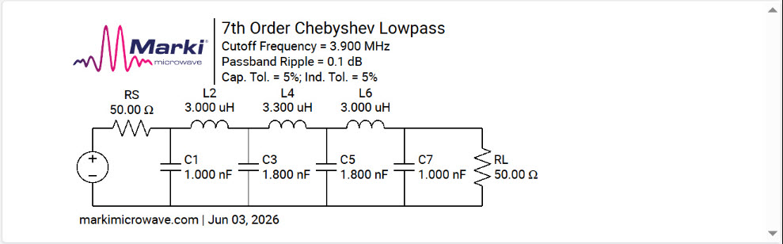 |
| **40 м** | 7,2 МГц | 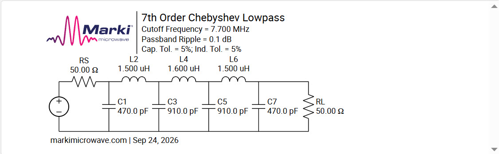 |
| **20 м** | 14 МГц | *Розрахунок буде додано* |
| **15 м** | 21 МГц | *Розрахунок буде додано* |

## Зовнішній вигляд

| Верхня сторона плати | Верхня сторона без компонентів | Нижня сторона |
|:---:|:---:|:---:|
| 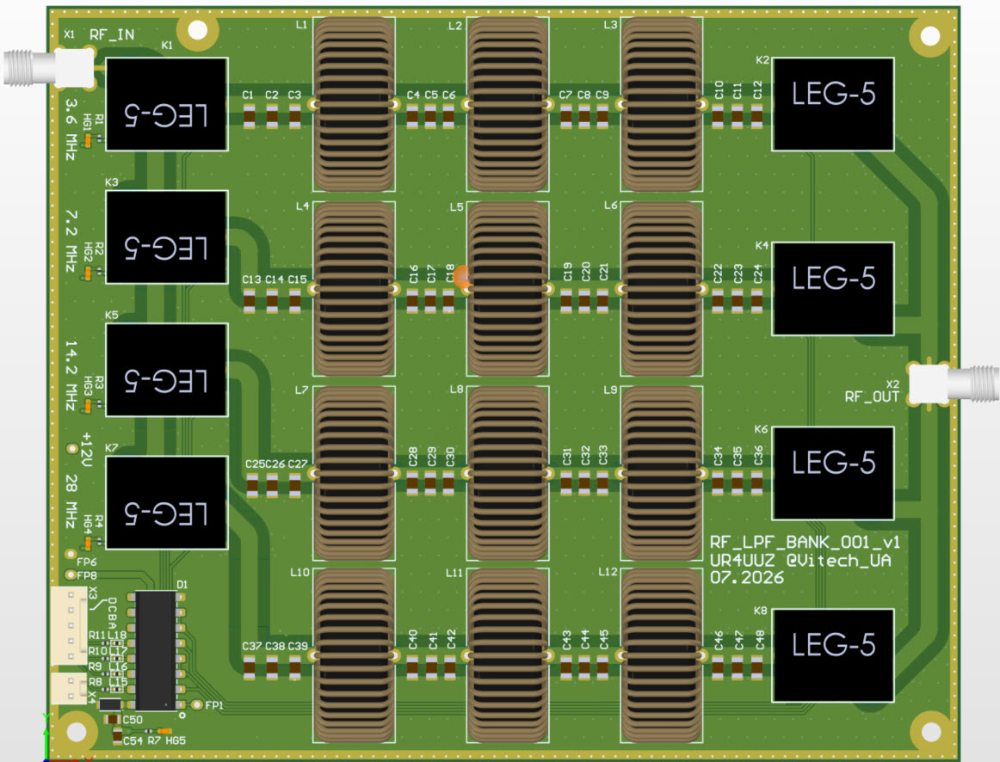 | 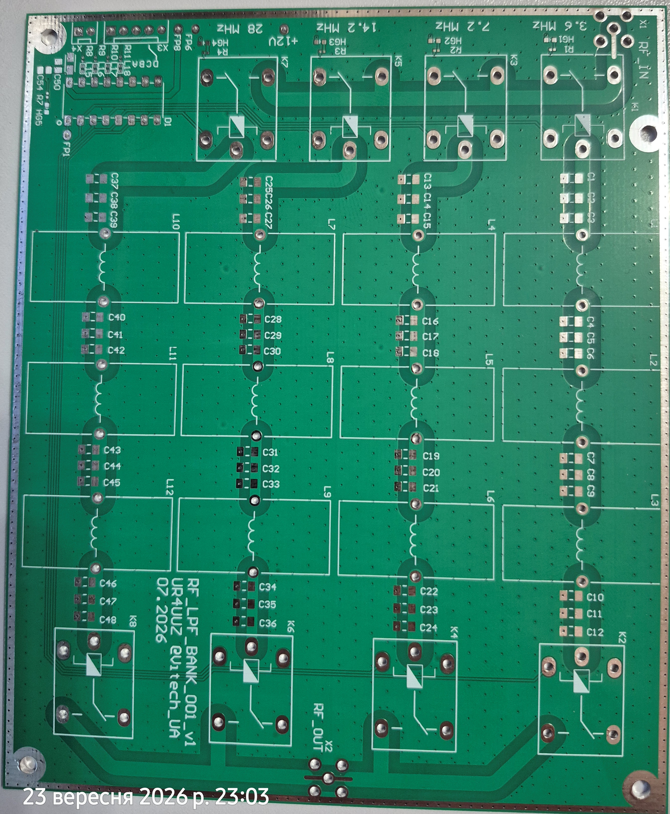 | 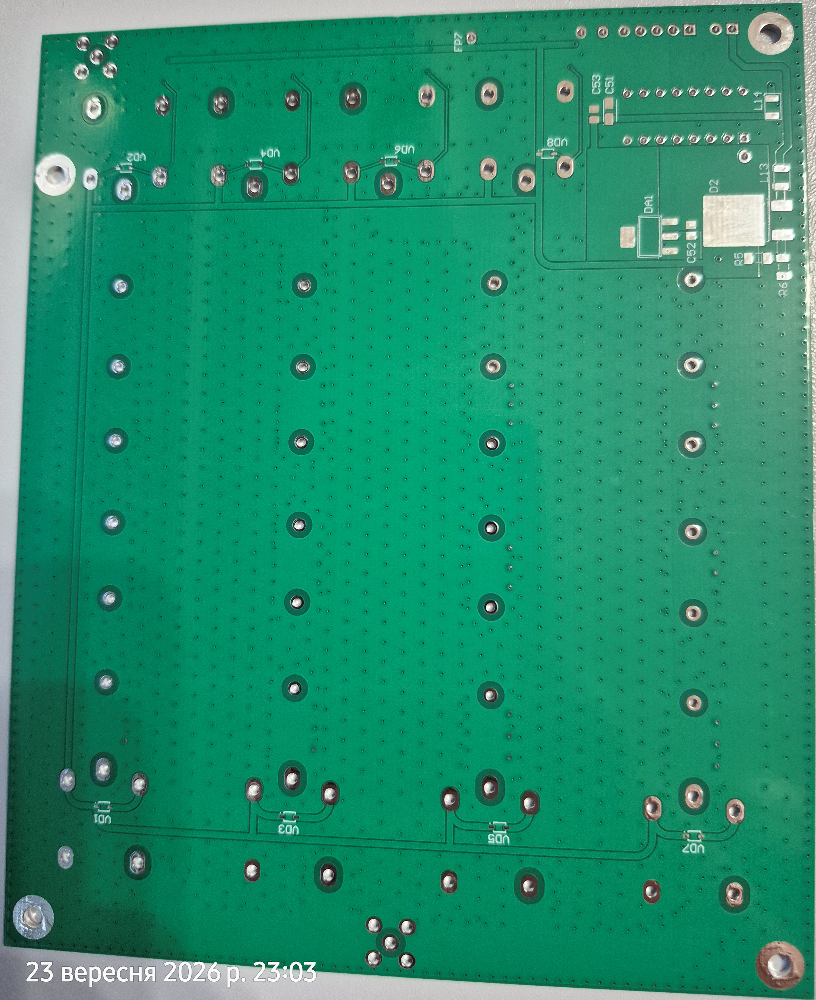 |

## Збірка (Без L & C)

| Верхня сторона | Нижня сторона |
|:---:|:---:|
| 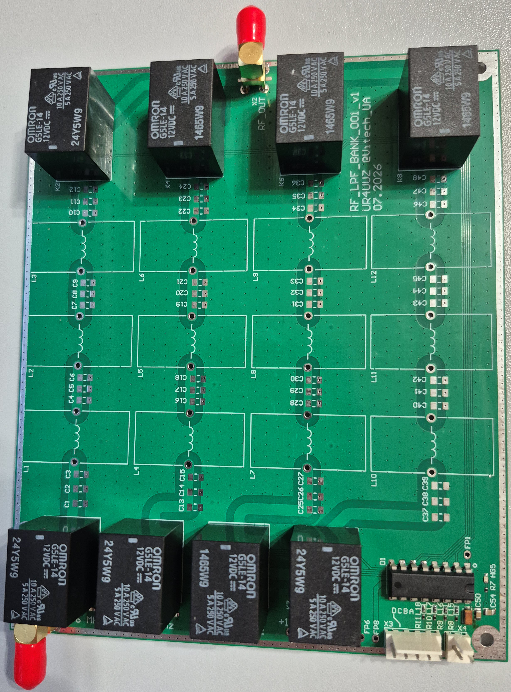 | 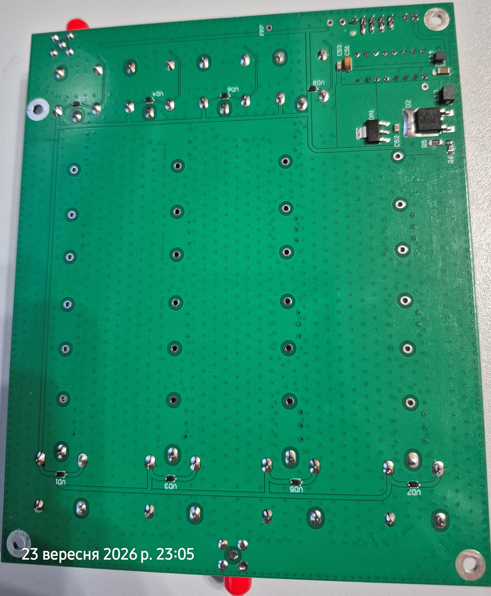 |

---

## Налаштування та результати вимірювань ФНЧ (Розкриваються)

<b>80 м — 3,6 МГц</b>

### Налаштування

*Фото буде додано.*

### Результати вимірювань

**S21 — Передача**

*Буде додано.*

**S11 — Відбиття**

*Буде додано.*

---

<b>40 м — 7,2 МГц</b>

### Налаштування

| Етап 1 | Етап 2 |
|:---:|:---:|
| 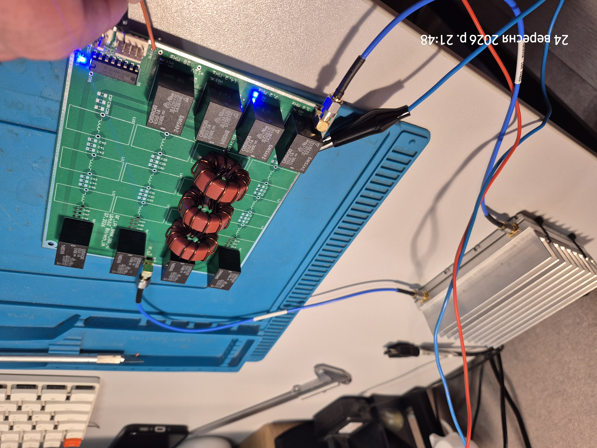 | 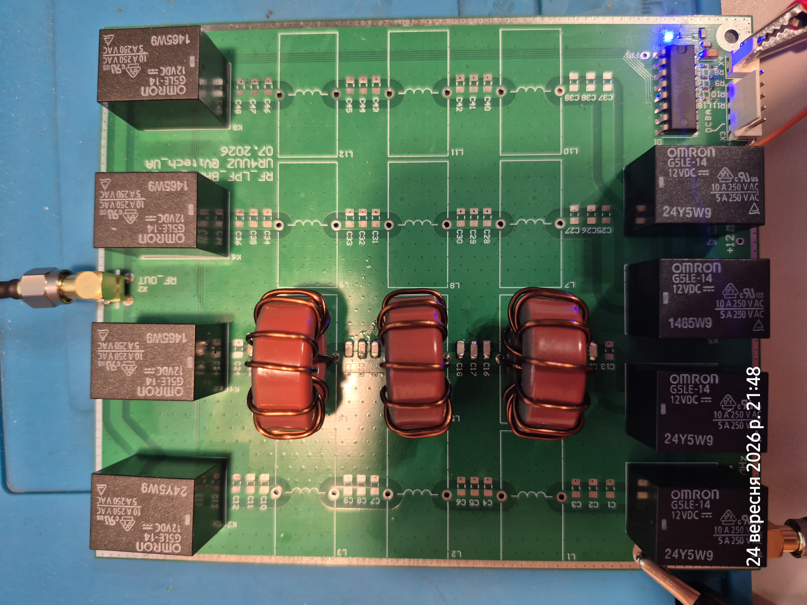 |

### Результати вимірювань

**S21 — Передача**

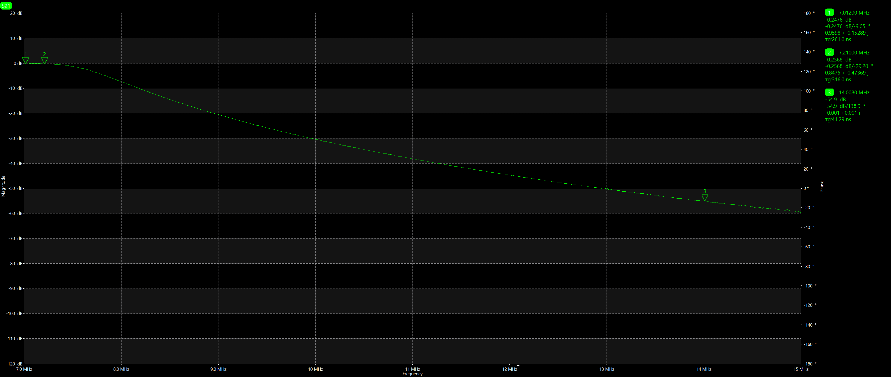

**S11 — Відбиття**

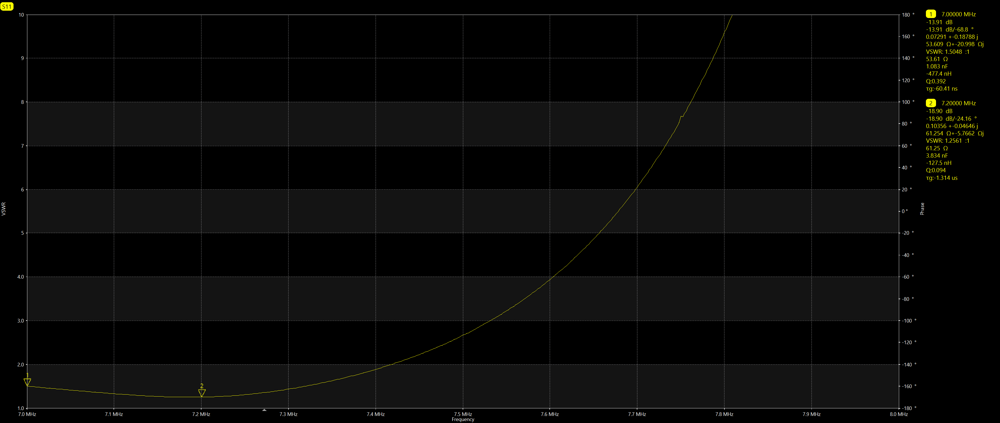

---

<b>20 м — 14 МГц</b>

### Налаштування

*Фото буде додано.*

### Результати вимірювань

**S21 — Передача**

*Буде додано.*

**S11 — Відбиття**

*Буде додано.*

---

<b>15 м — 21 МГц</b>

### Налаштування

*Фото буде додано.*

### Результати вимірювань

**S21 — Передача**

*Буде додано.*

**S11 — Відбиття**

*Буде додано.*

